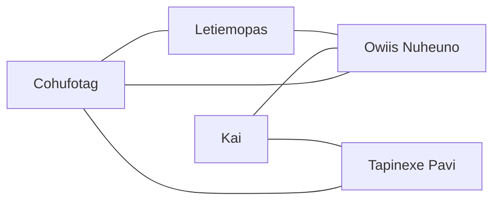

# Stars Reach - Sectors

## Connections

## Sectors

### Cohufotag

#### Cohufotag - Connections

- Starbase
- Sector Connections
  - Letiemopas
  - Owiis Nuheuno
  - Tapinexe Pavi
- Planets
  - Cohufotag I
  - Cohufotag II
  - Cohufotag III-B
  - Cohufotag IV-B

### Kai

#### Kai - Information

- Health: 96.0%
- Minerals: Quantity 70%, Diversity 100%
- Flora: Quantity 100%, Diversity 100%
- Fauna: Quantity 100%, Diversity 100%
- Servitor Edicts: Copper, Iron, Vesuvianite, Nickel, Tungsten

#### Kai - Connections

- Starbase
- Sector Connections
  - Owiis Nuheuno
  - Tapinexe Pavi
- Planets
  - Kai I
    - Population: 178
    - Mineral Edicts: Garnet, Gold, Salt, Amethyst, Bismuth
    - Flora Edicts: None
    - Fauna Edicts: None
  - Kai II
    - Population: 46
    - Mineral Edicts: Gold, Tin, Zinc, Nickel, Manganese
    - Flora Edicts: None
    - Fauna Edicts: None
  - Kai III-C
  - Kai IV-C

### Letiemopas

#### Letiemopas - Connections

- Starbase
- Sector Connections
  - Cohufotag
  - Owiis Nuheuno
- Planets
  - Letiemopas I
  - Letiemopas II
  - Letiemopas III-B
  - Letiemopas IV-B

### Owiis Nuheuno

#### Owiis Nuheuno - Information

- Health: 95.7%
- Minerals: Quantity 68%, Diversity 100%
- Flora: Quantity 100%, Diversity 100%
- Fauna: Quantity 100%, Diversity 100%
- Servitor Edicts: Copper, Iron, Vesuvianite, Nickel, Tungsten

#### Owiis Nuheuno - Connections

- Starbase
- Sector Connections
  - Cohufotag
  - Kai
  - Letiemopas
- Planets
  - Owiis Nuheuno I
  - Owiis Nuheuno II
  - Owiis Nuheuno III-C
  - Owiis Nuheuno IV-C

### Tapinexe Pavi

#### Tapinexe Pavi - Connections

- Starbase
- Sector Connections
  - Cohufotag
  - Kai
- Planets
  - Tapinexe Pavi I
  - Tapinexe Pavi II
  - Tapinexe Pavi III-B
  - Tapinexe Pavi IV-B
