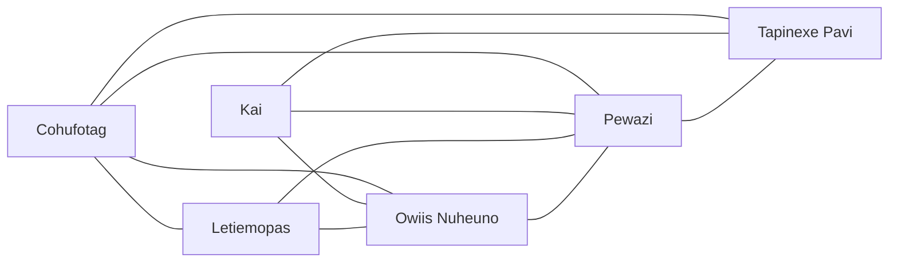

# Stars Reach - Sectors

## Connections

## Sectors

### Cohufotag

#### Cohufotag - Information

- Health: 95.1%
- Minerals: Quantity 63%, Diversity 100%
- Flora: Quantity 100%, Diversity 100%
- Fauna: Quantity 100%, Diversity 100%
- Servitor Edicts: Copper, Iron, Vesuvianite, Nickel, Tungsten

#### Cohufotag - Connections

- Starbase
- Sector Connections
  - Letiemopas
  - Owiis Nuheuno
  - Pewazi
  - Tapinexe Pavi
- Planets
  - Cohufotag I
    - Population: 111
    - Mineral Edicts: Diamond
    - Flora Edicts: None
    - Fauna Edicts: None
  - Cohufotag II
    - Population: 304
    - Mineral Edicts: Gold, Iron, Titanium, Diamond, Magnetized Iron, Tin, Bismuth
    - Flora Edicts: None
    - Fauna Edicts: None
  - Cohufotag III-B
  - Cohufotag IV-B

### Kai

#### Kai - Information

- Health: 96.0%
- Minerals: Quantity 70%, Diversity 100%
- Flora: Quantity 100%, Diversity 100%
- Fauna: Quantity 100%, Diversity 100%
- Servitor Edicts: Copper, Iron, Vesuvianite, Nickel, Tungsten

#### Kai - Connections

- Starbase
- Sector Connections
  - Owiis Nuheuno
  - Pewazi
  - Tapinexe Pavi
- Planets
  - Kai I
    - Population: 178
    - Mineral Edicts: Garnet, Gold, Salt, Amethyst, Bismuth
    - Flora Edicts: None
    - Fauna Edicts: None
  - Kai II
    - Population: 46
    - Mineral Edicts: Gold, Tin, Zinc, Nickel, Manganese
    - Flora Edicts: None
    - Fauna Edicts: None
  - Kai III-C
  - Kai IV-C

### Letiemopas

#### Letiemopas - Information

- Health: 95.8%
- Minerals: Quantity 69%, Diversity 100%
- Flora: Quantity 100%, Diversity 100%
- Fauna: Quantity 100%, Diversity 100%
- Servitor Edicts: Iron, Vesuvianite, Tungsten

#### Letiemopas - Connections

- Starbase
- Sector Connections
  - Cohufotag
  - Owiis Nuheuno
  - Pewazi
- Planets
  - Letiemopas I
    - Population: 253
    - Mineral Edicts: Copper, Gold, Magnetized Iron, Tin, Mercury, Magnesium, Lithium
    - Flora Edicts: None
    - Fauna Edicts: None
  - Letiemopas II
    - Population: 147
    - Mineral Edicts: Copper, Gold, Iron, Titanium, Diamond, Lapis Lazuli, Zircon, Tungsten, Magnesium
    - Flora Edicts: None
    - Fauna Edicts: Velocirabbit
  - Letiemopas III-B
  - Letiemopas IV-B

### Owiis Nuheuno

#### Owiis Nuheuno - Information

- Health: 95.7%
- Minerals: Quantity 67%, Diversity 100%
- Flora: Quantity 100%, Diversity 100%
- Fauna: Quantity 100%, Diversity 100%
- Servitor Edicts: Copper, Iron, Vesuvianite, Nickel, Tungsten

#### Owiis Nuheuno - Connections

- Starbase
- Sector Connections
  - Cohufotag
  - Kai
  - Letiemopas
  - Pewazi
- Planets
  - Owiis Nuheuno I
    - Population: 100
    - Mineral Edicts: Lapis Lazuli, Gold, Amethyst, Magnetized Iron
    - Flora Edicts: Banyan, Truffula, Papaya
    - Fauna Edicts: None
  - Owiis Nuheuno II
    - Population: 135
    - Mineral Edicts: Copper, Garnet, Gold, Iron, Opal
    - Flora Edicts: Baobab
    - Fauna Edicts: None
  - Owiis Nuheuno III-C
  - Owiis Nuheuno IV-C

### Pewazi

#### Pewazi - Connections

- Sector Connections
  - Cohufotag
  - Kai
  - Letiemopas
  - Owiis Nuheuno
  - Tapinexe Pavi

### Tapinexe Pavi

#### Tapinexe Pavi - Information

- Health: 96.1%
- Minerals: Quantity 71%, Diversity 100%
- Flora: Quantity 100%, Diversity 100%
- Fauna: Quantity 100%, Diversity 100%
- Servitor Edicts: Copper, Iron, Vesuvianite, Nickel, Tungsten

#### Tapinexe Pavi - Connections

- Starbase
- Sector Connections
  - Cohufotag
  - Kai
- Planets
  - Tapinexe Pavi I
    - Population: 64
    - Mineral Edicts: Gold
    - Flora Edicts: Baobab
    - Fauna Edicts: None
  - Tapinexe Pavi II
    - Population: 45
    - Mineral Edicts: Copper, Gold, Granite, Titanium, Diamond
    - Flora Edicts: None
    - Fauna Edicts: None
  - Tapinexe Pavi III-B
  - Tapinexe Pavi IV-B
